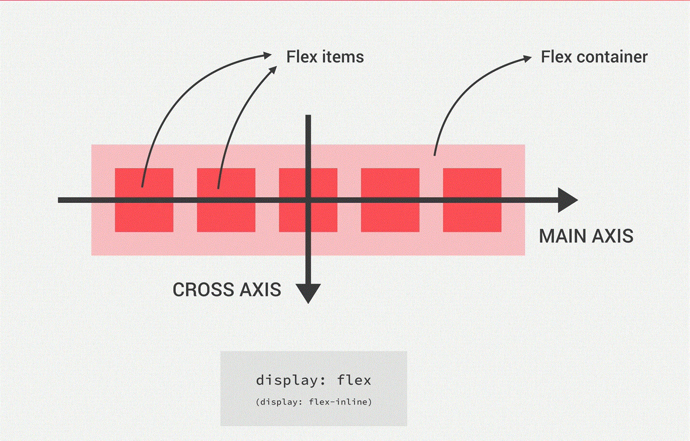
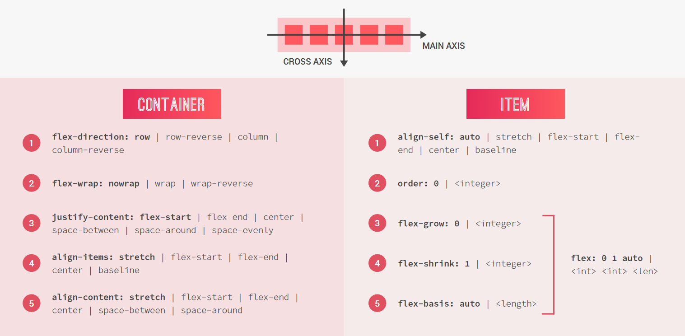
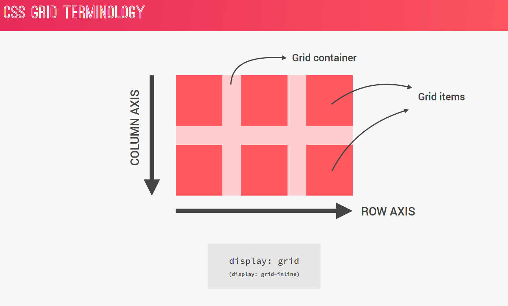
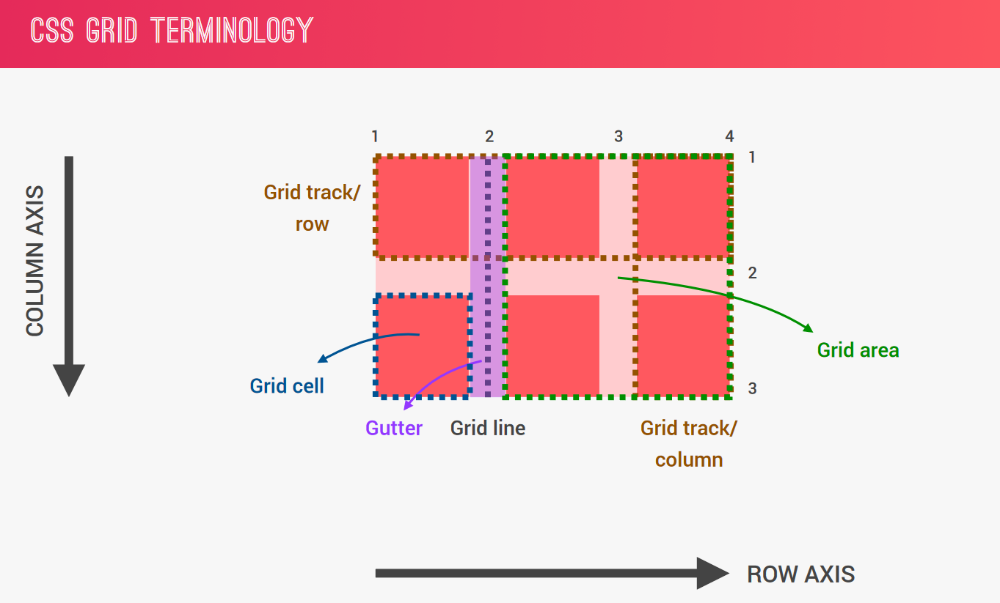
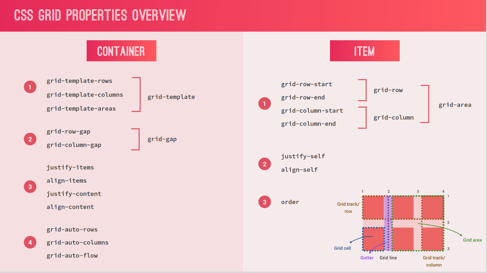

# Flex

**_Direction-ROW_**

- justify-content : horizontal(width) **_Main Direction_**
- aline-item : vertical(height)

**_Direction-COLUMN_**

- justify-content : vertical(height) **_Main Direction_**
- align-items : horizontal(width)

> Flex Container Property Explained

- `display:flex`
- default value **_(written in bold inside image)_**
# Grid

